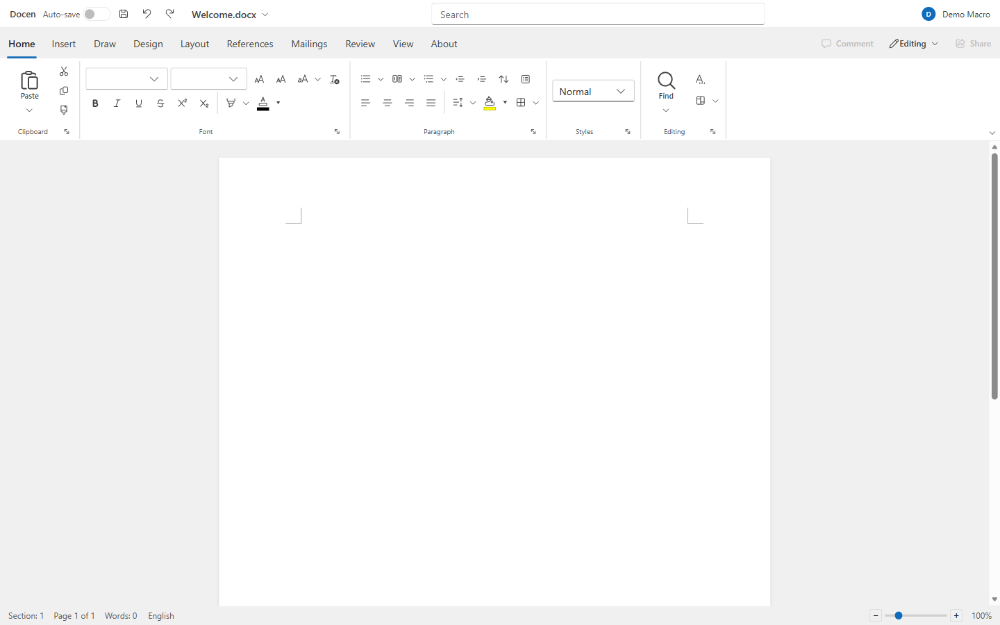

> **⚠️ Warning:** This project is not yet stable and may undergo significant changes before reaching version 1.0.0. We strongly advise against using it in production environments.

# Docen


[](https://www.contributor-covenant.org/version/2/1/code_of_conduct/)

> Universal document format converter and DOCX editor built on TipTap/ProseMirror, with comprehensive TypeScript support. Convert between Markdown, HTML, and DOCX through a unified Tiptap JSON model.



## Packages

| Package                                      | Version                                            | Description                                                                              |
| -------------------------------------------- | -------------------------------------------------- | ---------------------------------------------------------------------------------------- |
| [docen](./packages/docen/README.md)          |          | All-in-one — headless Markdown/HTML/DOCX conversion + the full `<docen-document>` editor |
| [@docen/vue](./packages/vue/README.md)       |     | Vue 3 adapter — `<DocenDocument>` component (v-model + v-slot editor)                    |
| [@docen/editor](./packages/editor/README.md) |  | Assembly layer — Fluent UI host + docx engine into `<docen-document>`                    |
| [@docen/docx](./packages/docx/README.md)     |    | Tiptap DOCX editor + converters, powered by @office-open/docx                            |

## Quick Start

### Universal Converter (`docen`)

For seamless conversion between Markdown, HTML, and DOCX through a single unified API:

```bash
# Install with pnpm
$ pnpm add docen
```

```typescript
import { parseHTML, generateDOCX, parseMarkdown, generateHTML } from "docen";

// HTML → DOCX
const doc = parseHTML("<h1>Title</h1><p>Hello World</p>");
const docx = await generateDOCX(doc);

// Markdown → HTML
const doc2 = parseMarkdown("# Title\n\nHello World");
const html = generateHTML(doc2);
```

> 💡 The `docen` package also bundles the full engine and editor — `import { createDocxEditor } from "docen/docx"` or `import { DocenDocument } from "docen/editor"` — so one dependency covers headless conversion, the engine, and the web component.

### DOCX Editor (`@docen/docx`)

A full-featured WYSIWYG DOCX editor with near-lossless round-trip conversion:

```bash
$ pnpm add @docen/docx
```

```typescript
import { createDocxEditor, parseDOCX, generateDOCX } from "@docen/docx";

const editor = createDocxEditor({ element: document.querySelector("#editor") });
editor.commands.setContent(parseDOCX(buffer));
const output = await generateDOCX(editor.getJSON());
```

### Visual Editor (`@docen/editor`)

A turnkey web-component editor (`<docen-document>`) bundling the Fluent UI host with the `@docen/docx` engine:

```bash
$ pnpm add @docen/editor
```

```html
<docen-document id="doc" filename="Welcome.docx"></docen-document>

<script type="module">
  import { registerComponents, applyTheme } from "@docen/editor";
  registerComponents();
  applyTheme("light");
</script>
```

### Vue (`@docen/vue`)

A typed `<DocenDocument>` component — `v-model` for content, a `v-slot="{ editor }"` scope, and a template-ref expose — for Vue 3:

```bash
$ pnpm add @docen/vue
```

```vue
<script setup lang="ts">
import { ref } from "vue";
import { DocenDocument } from "@docen/vue";
import { parseDOCX } from "@docen/docx";

// v-model keeps content in sync; the template ref exposes the Tiptap editor.
const content = ref("<p>Hello</p>");
const editorRef = ref();

async function open(file: File) {
  const json = await parseDOCX(await file.arrayBuffer());
  editorRef.value?.editor?.commands.setContent(json);
}
</script>

<template>
  <DocenDocument ref="editorRef" v-model="content" filename="Welcome.docx" editable />
</template>
```

## Development

### Prerequisites

- **Node.js** 18.x or higher
- **pnpm** 9.x or higher (recommended package manager)
- **Git** for version control

### Getting Started

1. **Clone the repository**:

   ```bash
   git clone https://github.com/DemoMacro/docen.git
   cd docen
   ```

2. **Install dependencies**:

   ```bash
   pnpm install
   ```

3. **Build all packages**:

   ```bash
   pnpm build
   ```

### Development Commands

```bash
pnpm build                       # Build all packages
cd packages/<pkg> && pnpm build  # Build one package
vp check                         # Lint & format
```

## Contributing

We welcome contributions! See [CONTRIBUTING.md](./CONTRIBUTING.md) for the full contribution workflow, coding standards, and PR checklist.

## Support & Community

- 📫 [Report Issues](https://github.com/DemoMacro/docen/issues)
- 📚 [docen Documentation](./packages/docen/README.md)
- 📚 [@docen/vue Documentation](./packages/vue/README.md)
- 📚 [@docen/editor Documentation](./packages/editor/README.md)
- 📚 [@docen/docx Documentation](./packages/docx/README.md)

## License

This project is licensed under the MIT License - see the [LICENSE](./LICENSE) file for details.

---

Built with ❤️ by [Demo Macro](https://www.demomacro.com/)
