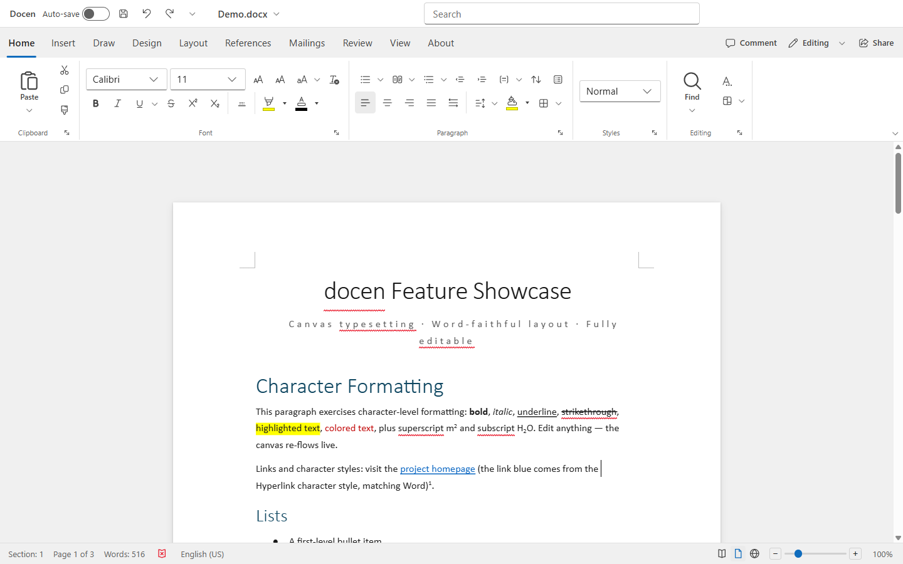

> **⚠️ Warning:** This project is not yet stable and may undergo significant changes before reaching version 1.0.0. We strongly advise against using it in production environments.

# Docen


[](https://www.contributor-covenant.org/version/2/1/code_of_conduct/)

> Universal document format converter and canvas DOCX editor built on TipTap/ProseMirror and LeaferJS, with comprehensive TypeScript support. Convert between Markdown and DOCX through a unified Tiptap JSON model; render and edit documents on a canvas that matches MS Office layout.



## Packages

| Package                                                     | Version                                                 | Description                                                                                |
| ----------------------------------------------------------- | ------------------------------------------------------- | ------------------------------------------------------------------------------------------ |
| [docen](./packages/docen/README.md)                         |               | All-in-one — headless Markdown/DOCX conversion + the full `<docen-document>` editor        |
| [@docen/vue](./packages/vue/README.md)                      |          | Vue 3 adapter — `<DocenDocument>` component (v-model + v-slot editor)                      |
| [@docen/editor](./packages/editor/README.md)                |       | Assembly layer — Fluent UI host + docx engine into `<docen-document>`                      |
| [@docen/docx](./packages/docx/README.md)                    |         | DOCX engine — Tiptap schema + converters + layout projection, powered by @office-open/docx |
| [@docen/layout](./packages/layout/README.md)                |       | Pagination engine — measurement → paginated LayoutDoc, Word's stacking rules               |
| [@docen/pretext](./packages/pretext/README.md)              |      | Vendored fork of @chenglou/pretext — CJK measure correction + Word/CJK layout fixes        |
| [@docen/core](./packages/core/README.md)                    |         | Scene painter — LayoutDoc → LeaferJS tree for the canvas editors                           |
| [leafer-x-metafile](./packages/leafer-x-metafile/README.md) |   | Zero-dependency WMF/EMF+ metafile replay → neutral drawing members                         |
| [@docen/deduplicate](./packages/deduplicate/README.md)      |  | Document comparison (SimHash + Winnowing) for the compare feature                          |

## Quick Start

### Universal Converter (`docen`)

For seamless conversion between Markdown, plain text, and DOCX through a single unified API:

```bash
# Install with pnpm
$ pnpm add docen
```

```typescript
import { parseMarkdown, generateDOCX, parseDOCX, generateMarkdown } from "docen";

// Markdown → DOCX
const doc = parseMarkdown("# Title\n\nHello World");
const docx = await generateDOCX(doc);

// DOCX → Markdown
const json = await parseDOCX(buffer);
const markdown = generateMarkdown(json);
```

Styled HTML from the clipboard is supported as **paste input** in the editor — the extensions' `parseHTML` rules turn it into document JSON. There is no HTML generation anywhere.

> 💡 The `docen` package also bundles the full engine and editor — `import { createDocxEditor } from "docen/docx"` or `import { DocenDocument } from "docen/editor"` — so one dependency covers headless conversion, the engine, and the web component.

### DOCX Engine (`@docen/docx`)

The DOCX engine — Tiptap schema, converters, and the layout projection — with near-lossless round-trip conversion:

```bash
$ pnpm add @docen/docx
```

```typescript
import { docxExtensions, parseDOCX, generateDOCX } from "@docen/docx";
import { Editor } from "@docen/docx/core";

// Viewless: the editor is the editing model — rendering belongs to the host.
const editor = new Editor({
  element: null,
  extensions: docxExtensions,
  content: await parseDOCX(buffer),
});
const output = await generateDOCX(editor.getJSON());
```

### Visual Editor (`@docen/editor`)

A turnkey web-component editor (`<docen-document>`) bundling the Fluent UI host, the `@docen/docx` engine, and the LeaferJS canvas stage:

```bash
$ pnpm add @docen/editor
```

```html
<docen-document id="doc" filename="Welcome.docx"></docen-document>

<script type="module">
  import { registerComponents, applyTheme } from "@docen/editor";
  registerComponents();
  applyTheme("light");
</script>
```

### Vue (`@docen/vue`)

A typed `<DocenDocument>` component — `v-model` for content, a `v-slot="{ editor }"` scope, and a template-ref expose — for Vue 3:

```bash
$ pnpm add @docen/vue
```

```vue
<script setup lang="ts">
import { ref } from "vue";
import type { JSONContent } from "@docen/docx";
import { DocenDocument } from "@docen/vue";
import { parseDOCX } from "@docen/docx";

// v-model carries Tiptap JSON; the template ref exposes the Tiptap editor
// plus a getJSON/setJSON pair.
const content = ref<JSONContent>({ type: "doc", content: [{ type: "paragraph" }] });
const editorRef = ref();

async function open(file: File) {
  const json = await parseDOCX(await file.arrayBuffer());
  editorRef.value?.setJSON(json); // preserves doc.attrs.styles
}
</script>

<template>
  <DocenDocument ref="editorRef" v-model="content" filename="Welcome.docx" editable />
</template>
```

## Development

### Prerequisites

- **Node.js** 18.x or higher
- **pnpm** 9.x or higher (recommended package manager)
- **Git** for version control

### Getting Started

1. **Clone the repository**:

   ```bash
   git clone https://github.com/DemoMacro/docen.git
   cd docen
   ```

2. **Install dependencies**:

   ```bash
   pnpm install
   ```

3. **Build all packages**:

   ```bash
   pnpm build
   ```

### Development Commands

```bash
pnpm build                       # Build all packages
cd packages/<pkg> && pnpm build  # Build one package
vp check                         # Lint & format
```

## Versioning

This project follows [Semantic Versioning](https://semver.org/). While the major version is `0` (pre-1.0), breaking API changes are released as **minor** version bumps (`0.x.0`) rather than patch releases — the public API is expected to keep evolving until the `1.0.0` stabilization release. Pin exact versions in downstream projects if you require stability between minor updates.

## Contributing

We welcome contributions! See [CONTRIBUTING.md](./CONTRIBUTING.md) for the full contribution workflow, coding standards, and PR checklist.

## Support & Community

- 📫 [Report Issues](https://github.com/DemoMacro/docen/issues)
- 📚 [docen Documentation](./packages/docen/README.md)
- 📚 [@docen/vue Documentation](./packages/vue/README.md)
- 📚 [@docen/editor Documentation](./packages/editor/README.md)
- 📚 [@docen/docx Documentation](./packages/docx/README.md)
- 📚 [@docen/layout Documentation](./packages/layout/README.md)
- 📚 [@docen/core Documentation](./packages/core/README.md)
- 📚 [leafer-x-metafile Documentation](./packages/leafer-x-metafile/README.md)

## License

This project is licensed under the MIT License - see the [LICENSE](./LICENSE) file for details.

---

Built with ❤️ by [Demo Macro](https://www.demomacro.com/)
